# Learn XML (For Beginners)

Follow below links to learn XML:

- [W3Schools - XML Tutorial](https://www.w3schools.com/xml/)
- [Guru99 - XML Tutorial for Beginners](https://www.guru99.com/xml-tutorials.html)
- [Joe Marini - XML Essential Training](https://www.linkedin.com/learning/xml-essential-training-2)

## Getting Started

### <strong>What is XML?</strong>

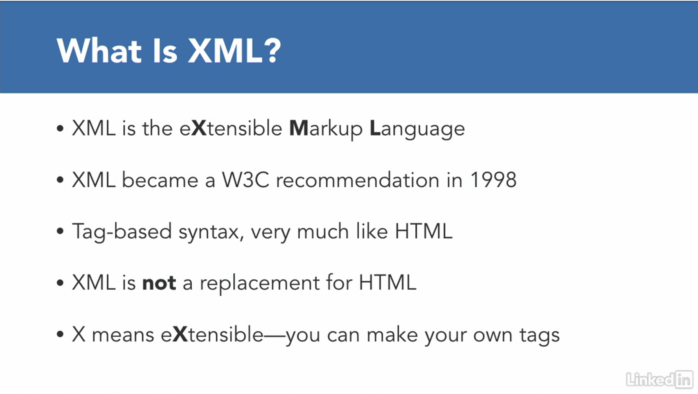


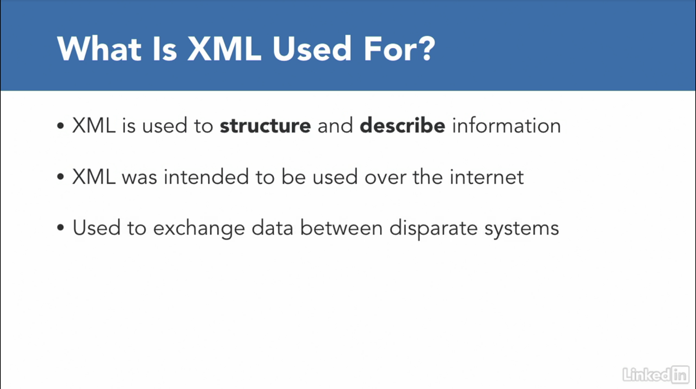

### <strong>XML Technologies</strong>

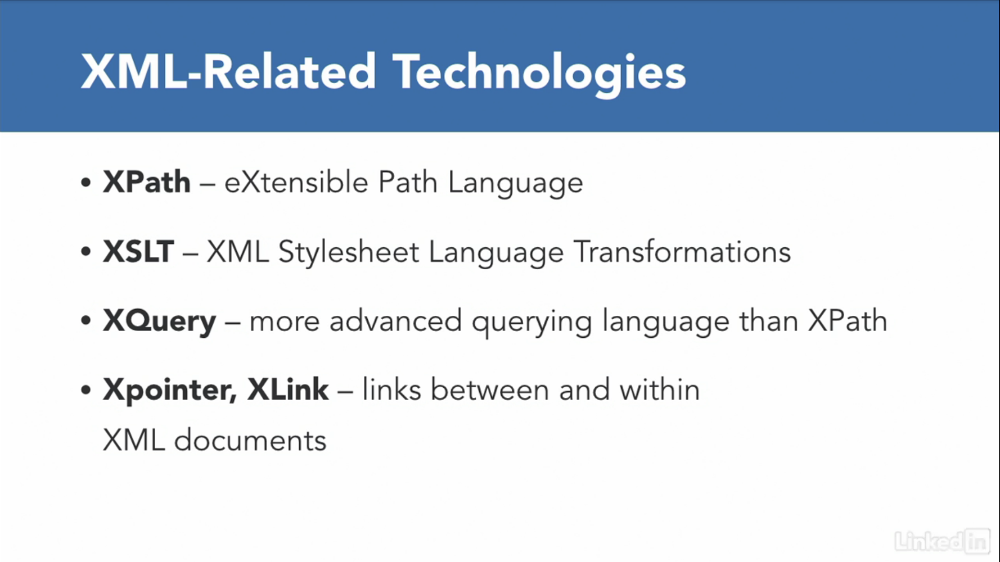

In addition to XML itself, there are certain related technologies that make working with XML to solve certain problems easier and more productive.

### <strong>Describing Data with XML</strong>

One of the main purposes of XML is to structure and describe information. Let's understand it with an example.\
To illustrate this example, let's consider some information that you would typically find on a business card, such as a person's name, various phone numbers, and maybe an email address, and there might be some additional information on a business card, like a company name, but just to keep the example simple, let's just agree that this is some fairly common data you'd find on a business card.

```
John S.

- +91-99999999999 (home)
- +91-88888888888 (work)
- +91-77777777777 (mobile)
```

You see, there are labels to describe the information that's on the business card, and ***this is an example of what XML does.*** It applies description and structure to the data that you're working with. So if we were to take the same example and look at it in XML, we might be able to structure it in a certain way. So, for example, I might have a tag called \<BusinessCard\> and the business card tag might be the root tag that holds other data, like for example, the name. And there might be various tags like phone, and the phone tag might have an attribute that describes what kind of phone it is, whether home or work or mobile, and there might be a tag for email. Now, you might be looking at this and saying, well, wait a second, business card tag, phone tag, I've never seen anything like this, and you're right. Now, if there was a business card XML tag set existing already that I could use to solve this data problem, I could go ahead and use it, but imagine for a moment that there was no such XML standard and the truth is I don't know if there is or isn't, but I could decide to sit down and create my own XML language called business card.

```
<BusinessCard>
    <name>John S.</name>
    <phone type="home">+91-99999999999</phone>
    <phone type="work">+91-88888888888</phone>
    <phone type="mobile">+91-77777777777</phone>
    <email>john@john.com</email>
</BusinessCard>

```
Remember, the X in XML stands for extensible, so if you have a particular data related problem or task and you want to use XML to solve it, you could either use an existing XML language if there is one, or you could just make one up.

Now, once I've done this, once I've collected this data here in XML, I can now take this data and give it to any other XML aware program. That program can then parse and extract data from this business card. Now, that program may not know what a business card is or what the various tags mean, but because XML is an open text-based standard, any application that can read XML would at least be able to parse this data from the business card file.

### <strong>Advantages and Drawbacks of XML</strong>

<strong><u>Advantages</u></strong>

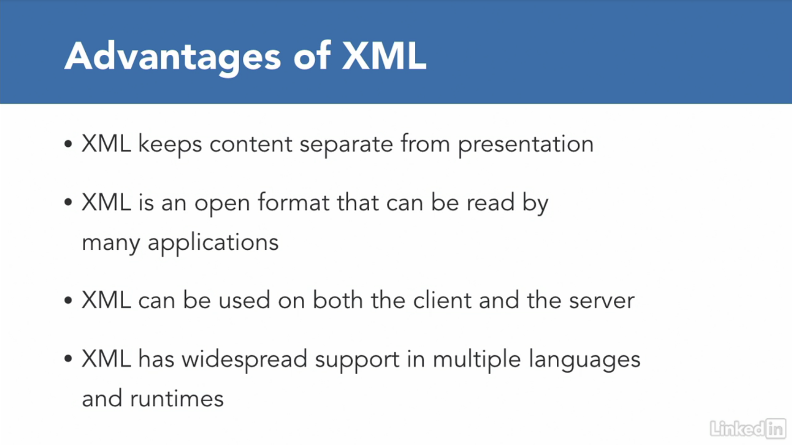

- XML keeps content separate from presentation. You can take the data that your application uses and store it separately from how it's presented to users. That way, regardless of what kind of presentation medium you're using, whether it's mobile or desktop or print media, you can just simply flow the data into various layouts, and you can maintain a good separation between the content from how it's presented.

- XML is also an open format that can be read by many applications, and many applications today have also the ability to output XML, like Microsoft Office. So, because it's an open format, you can store your data in a way that can be read by many different applications, even those that haven't been written yet.

- XML can be used on both the client and the server, because remember, it's just a data format. Today's modern browsers, like Firefox, Chrome, Edge, Safari, can work with XML data. You can also use XML data in your applications. Whether they're client apps or server apps, they're just a really good way of storing information.

- XML has widespread support in multiple languages and runtimes. You can use XML from Python and C# and .NET and Visual Basic and Java, and lots of other programming languages. Even JavaScript. This support extends to different runtime platforms. XML can be used on .NET, Java, iOS, Android. You can use XML pretty much just about everywhere.

- XML also makes it possible for disparate systems to exchange data. These could be systems that were never designed to talk to each other in the first place. Let's suppose you have two computers and you want to share information between them. The problem is, one of those computers is modern and speaks a certain language. And the other one of those computers is a little bit older and only knows a different language. So, what do you do? XML can be used to help solve this problem. XML can create a bridge between these two computer systems so that they can exchange data, even though they're not aware of each other's native way of working with data.

<strong><u>Drawbacks</u></strong>

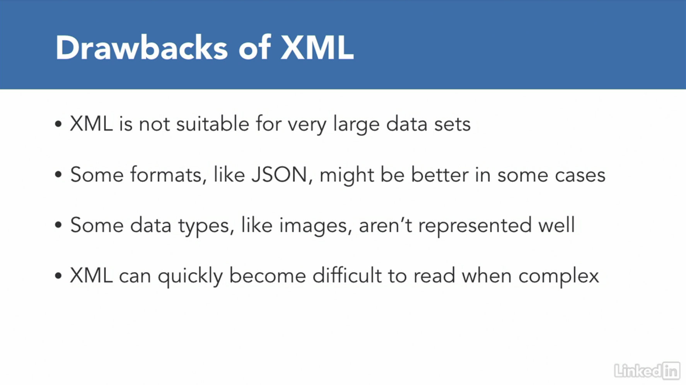

- It's not suitable for very large data sets. When I say very large data sets, that might vary. It's really up to you to decide, but generally, once you start getting into multiple megabytes of data, XML is probably not the most efficient way of storing it. XML does make it easy to interchange data, but as far as storing large data sets, databases are probably still the way to go.

- Some formats, like JSON, might be better in some cases, depending on how you're going to use the data. If you know that the data is going to be used in a JavaScript execution environment, for example, they're might be some cases where JSON is just more efficient.

- Some data types, like images, aren't represented well in XML because it's a text format and images aren't. Now, there is a way to do this. You can encode images and insert them into XML documents, but that gets ugly pretty quickly. And even though it's possible, it may not always be the best way of doing it.

- In XML, when it gets really complex, can quickly get hard to read. Now, if you're not planning on having humans reading your XML files, this may not be a big deal. But, it is something to be aware of.

## XML Overview

In this section, we will learn about basic rules of XML.

### <strong>Types of XML Content</strong>

Let's start of by learning the contents of XML files. There are about a half dozen or so types of XML content that you'll typically run into when working with XML data. If you're already familiar with HTML then many of these probably already look familiar.

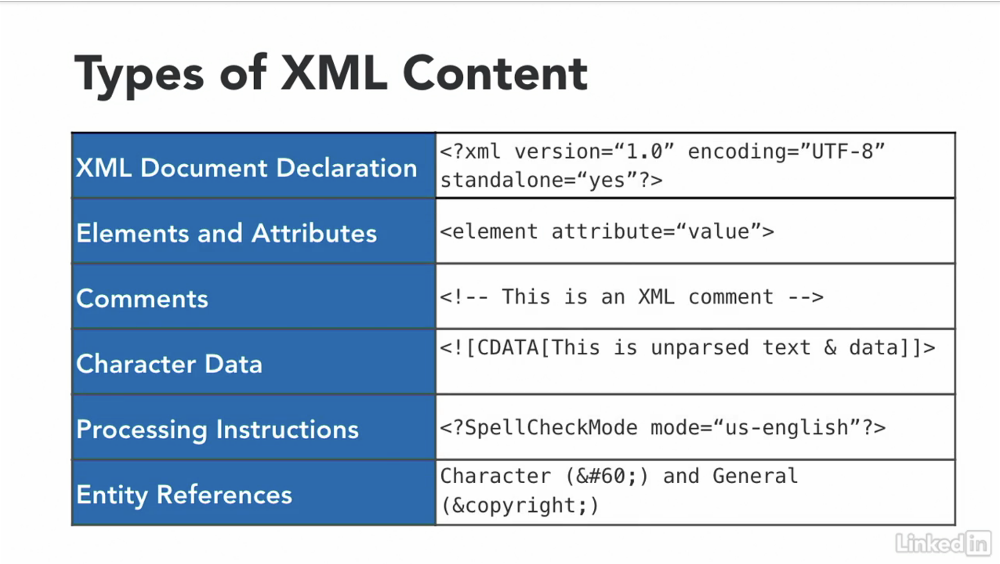

<strong><u>The Document Declaration</u></strong>


The document declaration looks like this. It's an opening bracket with a question mark followed by the letters xml and then a version and encoding and then optional standalone declaration. The document declaration is technically optional though the W3C recommends it. It's always a good idea to have the document declaration. It identifies the file as an XML document and provides a place for the encoding and standalone attributes. It has to be at the very beginning of a file. You can't even have whitespace before it.

<em>Encoding Attribute</em>

The encoding attribute defaults to UTF-8 if you don't include it but it's always a good idea to include it. And if you decide to use a character set other than UTF-8 like Unicode UTF-16 for example this is where you would put that declaration.

<em>Standalone Attribute</em>

The standalone attribute identifies whether or not the document stands by itself or depends on something else. If it requires other data then you should say standalone equals no. Otherwise if the XML data is complete by itself you can set this attribute to yes.


<strong><u>XML Elements (Tags)</u></strong>

Next are XML elements which are sometimes called tags and if you've ever worked with HTML these will entirely familiar to you. Elements must have valid names.


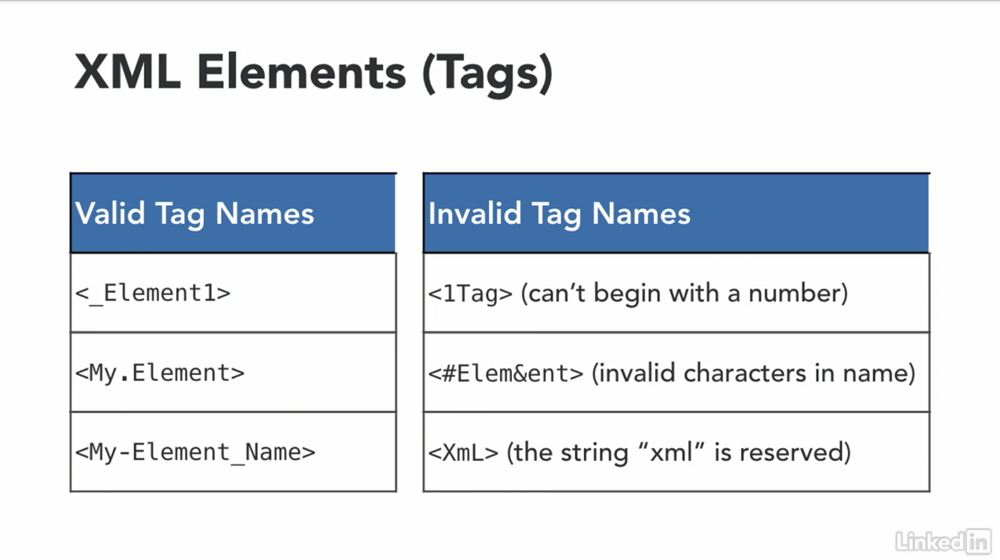

Attributes in XML work the same way they do in HTML. They're specified on opening elements tags only. They have to start with a letter or an underscore.

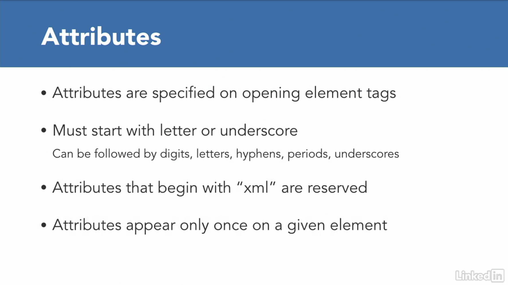

<strong><u>Comments</u></strong>

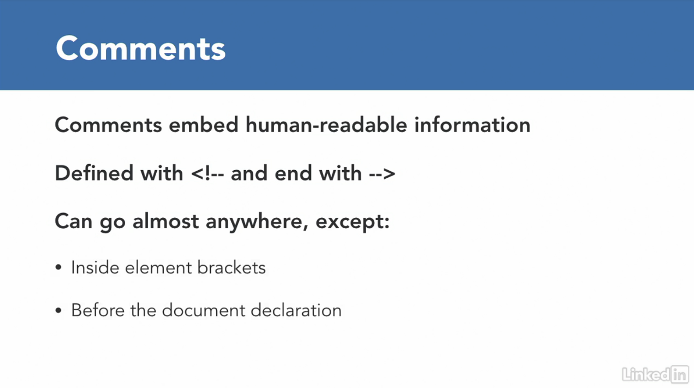

<strong><u>Character Data Section</u></strong>

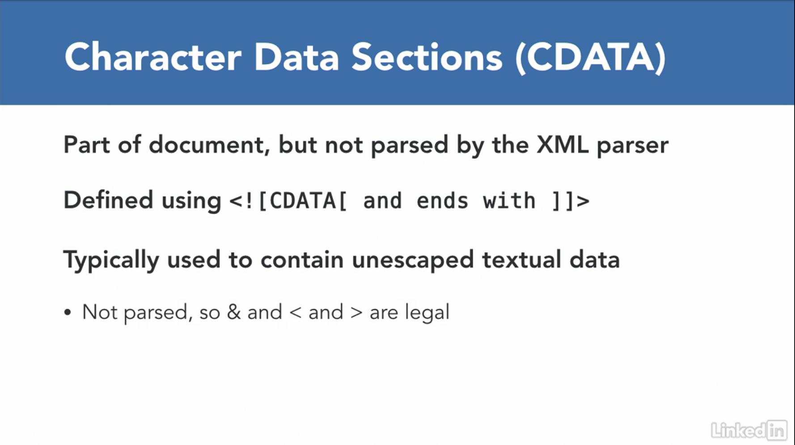

Character data sections are specific using CDATA and they're part of the document content. The actual contents of CDATA sections are not parsed by the XML parser. It simply skips the internal content it doesn't try to figure what kinds of data might be in there. It just skips over the entire section. They're defined by using an open angle bracket followed by an exclamation point and then a square bracket, the word CDTATA and another square bracket and they end with two square brackets and a closing angle bracket. They're typically used to contain unescaped text data such as characters that aren't legal within parsed XML.

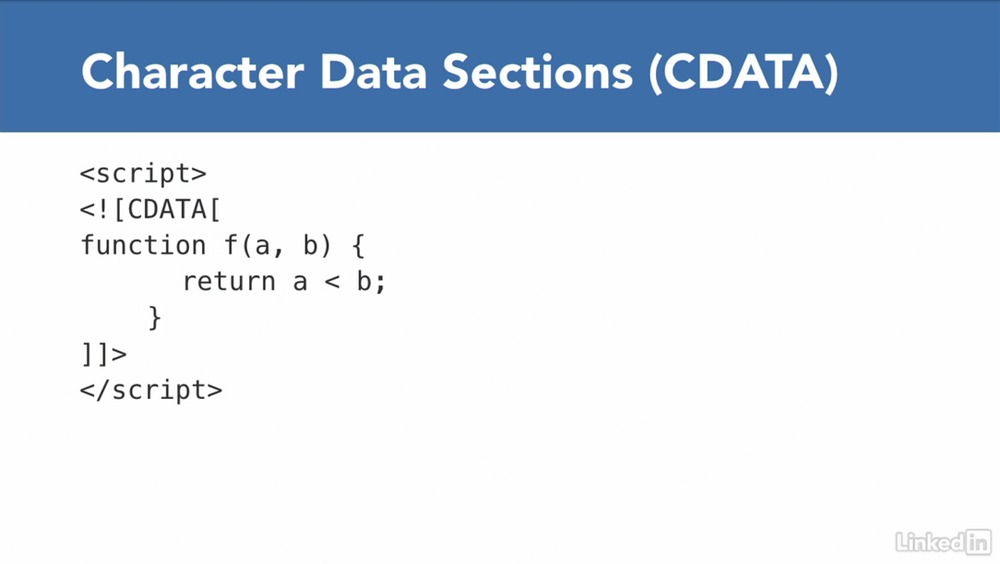

For example, suppose I had an XML document that contained a script tag and inside that script I had a function. Now this is going to cause a problem in XML because that return statement right there with ***a < b*** contains an angle bracket. This isn't an issue in HTML because the browser knows where a script tag is and when the browser is parsing the script tag it knows not to look for things like angle brackets and to treat them as opening tag names but an XML parser don't know. Remember you can make your own tags up so inside a tag if you have an illegal character that's going to cause a problem. So the way you get around this problem is by enclosing this in a CDATA section. This will cause the parser to skip over the contents and then you can put whatever characters you want in there.

<strong><u>Processing Instructions</u></strong>

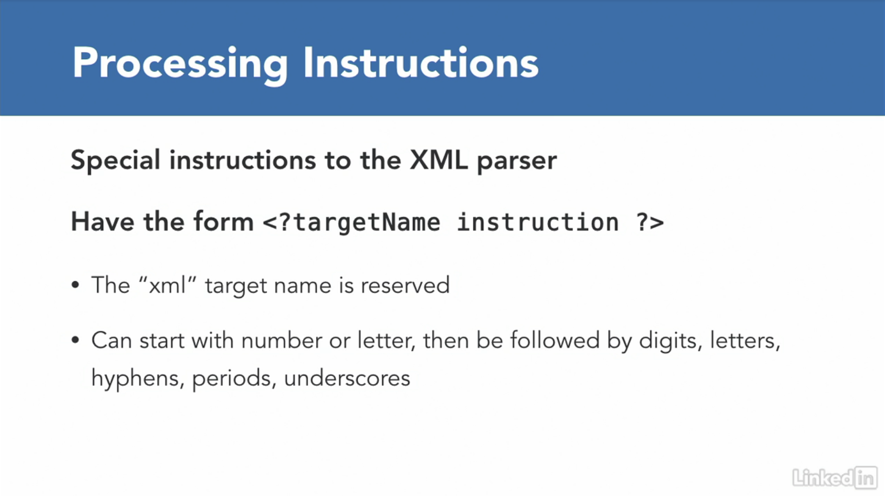

Processing instructions are a way for XML content to delivery special instructions to the XML parser. They have the form of an open angle bracket followed by a questions with a targetName and an instruction followed by a question mark and a closing angle bracket. Now if you're paying attention you might be saying to yourself, well wait a second that's the same format as the XML document declaration and you're right. It is, it's pretty much the same format. The xml target name is reserved because it's part of the document declaration but a processing instruction can start with a number or a letter, and be followed by digits or letters, hyphens, periods and underscores.

An example of why you might use a processing instruction is maybe you have an application that has multiple spell-checking modes and a particular document might want to indicate to your app that a particular language should be used when a document is being spell-checked. It's just a way for the XML data to contain information that the parser itself can use to affect how the parsing is executed.

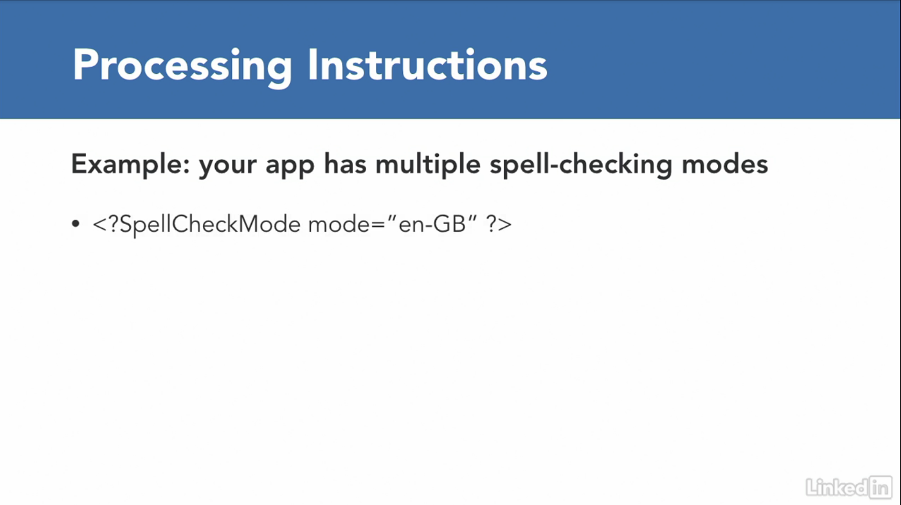

<strong><u>Entities</u></strong>

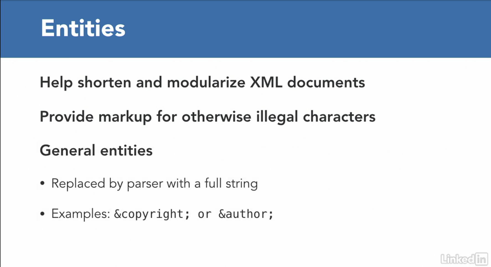

There are also character entities. For example, if you wanted to include a specific character which is not available in the keyboard in your XML data you can do that by using ampersand followed by a hash symbol and then the character's code number. Some character entities also have special names. For example the ampersand itself is written by ampersand then amp a semicolon or quote characters which are an ampersand Q-U-O-T and then a semicolon.

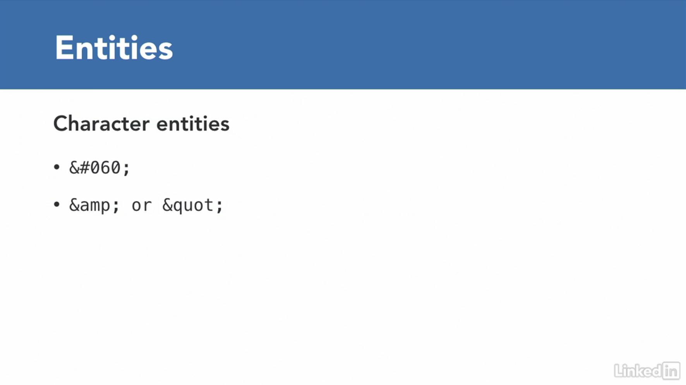

### <strong>Proper XML Syntax</strong>

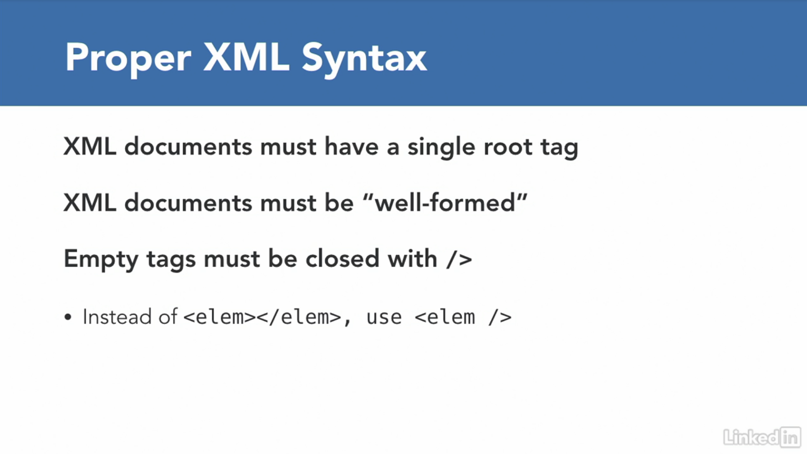

- XML documents must have a single root tag. They have to have one, it's required, and if you remember back to the business card example, the business card tag was the root tag in that particular document.

- XML documents also must be what's called well-formed. In other words, there are certain syntax rules that XML documents have to adhere to. The first one is that empty tags have to be closed with a slash before the closing angle bracket. Now, this is different than HTML, for example, where image tags are empty, but they don't have that trailing slash, and the reason is because the browser knows what HTML is, it knows there's a tag called IMG, and it knows that it's empty. In XML, however, remember, you get to make up your own tags, and the program that's parsing the XML may not know what a particular tag is or what it means, so you have to indicate that a particular tag is empty by including that trailing slash there before the closing angle bracket.

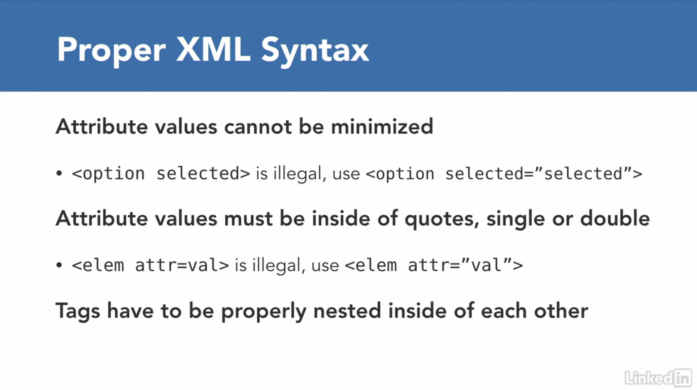

- Attribute values can also not be what's called minimized, and you typically see this, for example, when you're working with ***select lists*** in HTML. On option tags, for example, you can just simply put the word **selected** as an attribute with no value, and the select list will show up in the web browser with that option selected. Now, in XML, again, there's no way for the XML program to know whether your attribute requires a value or not, so the way to get around this is by putting the name of the attribute and then equal to the name of the attribute as the value.

- Attribute values also have to be inside of quotes, either single or double. Now, in HTML, you can get away with just putting attribute equals value, but in XML that doesn't fly. You have to put the values inside quotes.

- And then finally, tags have to be properly nested inside of each other. Back in the old days, browsers let you get away with this because they could basically figure out what you meant. So, for example, if you had bold and italic text, you had an opening B tag and then an opening I tag, but then you closed the B tag and then closed the I tag, the browser would pretty much forgive you, 'cause it could figure out what was going on. In XML, that's illegal, you have to have the tags properly nested and completely inside of each other.

### <strong>Valid Documents</strong>

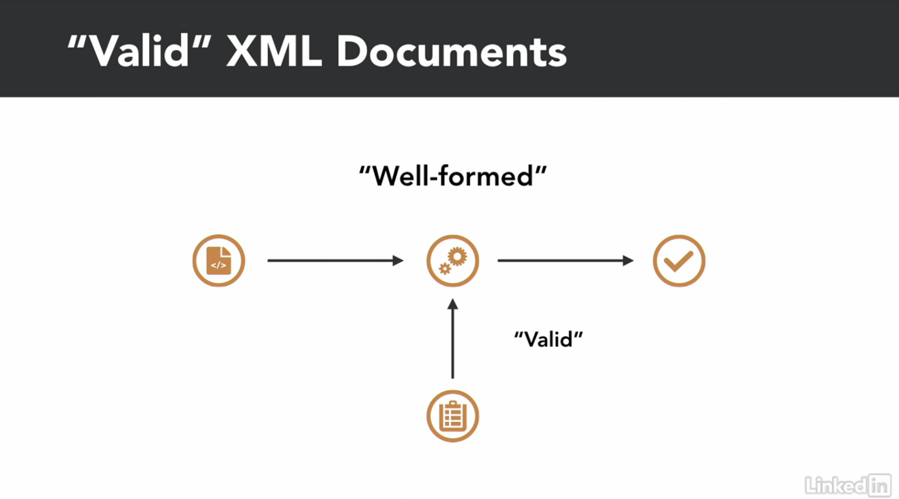

Suppose you have an XML parser represented by these **gears** in above figure. You give it an XML file and then as long as the syntax is proper and you've correctly named your elements and you've followed the XML syntax rules then good results come out the other side. And that's what we mean by saying that an XML file is well formed. But there's another way to make sure that XML documents are what's called valid. You can apply a set of rules which are applied to the parsing process in addition to the well-formness checks.

For example you can supply rules that say things like tag A is only ever allowed to incur inside of tag B and attribute X only has these values and so on. If the XML parser parses the document correctly and the document content passes the rules then the document is valid in addition to well-formed.

There are two ways to do this.

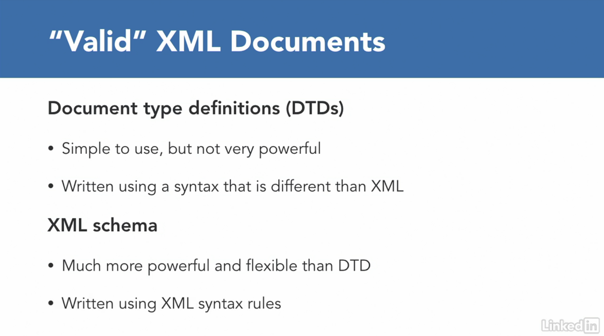

The first is called document type definitions. The second is called XML schema. Document Type definitions are simple to use but they're not very powerful. They give you basic ways of making sure that certain content meets basic rules. They're written using as syntax that's somewhat different than XML. It's similar but not exactly the same. XML schema on the other hand is much more powerful and flexible then DTDs are. And they're written using XML syntax rules.

### <strong>XML Namespaces</strong>

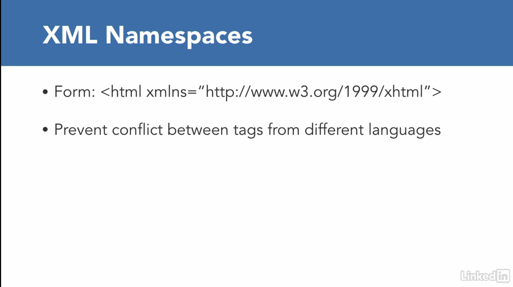

- XML Namespaces have the form of the letters XMLNS and then equal to some character string. And if you've used HTML before, you've probably seen something like as shown above in image. It usually appears on the HTML tag. Now the character string that goes inside that XMLNS attribute just has to be unique. It's usually a URL, but it doesn't have to be. The spec just says it needs to be a unique value. And in fact, the XML parser doesn't even try to access whatever is at that URL.

- XML Namespaces are used to prevent tags from different languages from conflicting each other when you try to use them in the same XML document.Now if I want to create an XML document that includes tags from different tag sets, there's the potential for someone using the same name for a tag that I've decided to use in my tag set.


So, let's take a look at an example. Suppose I have an HTML file with a table in it and HTML tables have things like table rows and table cells. They're used to lay out tabular data. However, if I create an XML document and I work for, say, a furniture company, to me, a table means something completely different. I'd have a table and my table definition for furniture might have a type. It's going to have a price, a material, how many I have in stock. Well if I try to use my XML table inside my HTML table, that's going to cause problems. The process is going to look at the table tag and say, "Wait a minute, what is type? What is Price? I've never seen this before." So if we want to take the XML data from the furniture table and include it in our HTML file, we need a way to make sure that the two table tags don't collide with each other. ***And that's where XML Namespaces come in.***

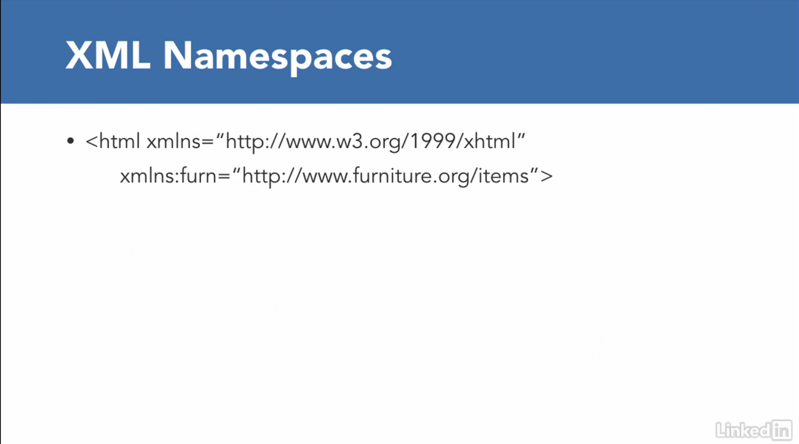

The way you'd solve this is by defining an XML Namespace for your tag set. Now here on my HTML tag, I would have the XMLNS equals and that's the XHTML Namespace. And it's followed by another Namespace definition. In this case, I've got XMLNS and then furn for furniture. And I'm pointing to a URL that I just completely made up. I have no idea whether that actually exists or not, but I'm just illustrating an example here. The first XMLNS definition, the one without the colon, is called the default Namespace. Any tag that doesn't have a prefix in front of it is assumed to be in the default Namespace.

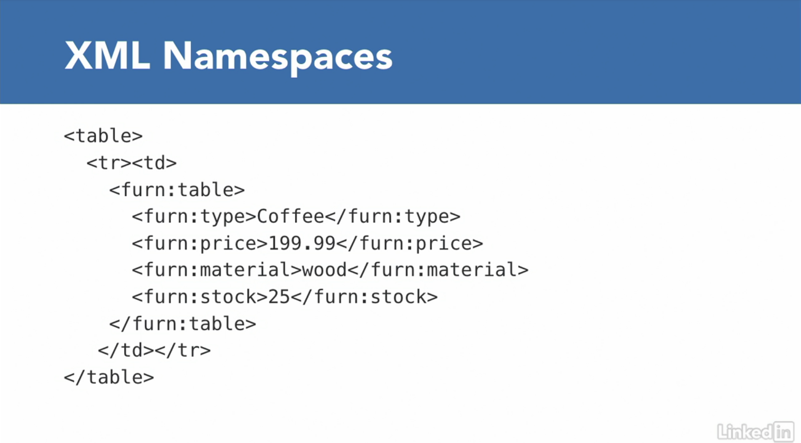

So here in the HTML document, if there's a tag that appears in HTML, and there's no prefix, then the browser will just assume that's part of the HTML definition. So here's how you'd use this. Inside my HTML, I can define my table just like I always do. I have my table tag, my table row, table cell. But now, in order to include the furniture table definition, I simply put the prefix furn in front of the tags that appear in my furniture table Namespace. So you can see that that matches up with the XML Namespace definition I included at the top of the file. So now when the browser comes across a tag that has the furn prefix in front of it, it's going to say, "Okay, well I don't know what this is, but it's a well-formed tag and it's embedded in my content. And I'll parse it but I'm not going to try to interpret it or figure out what to do with it." This is how XML Namespaces are used, so that you can combine data from separate sources without having to worry about name collisions.

## Working with XML

### <strong>Our First XML</strong>

Checkout here - [First XML](03-Working_with_XML/01-firstXML.xml)

If you open this file in browser, you will find a message saying "This XML file does not appear to have any style information associated with it". And then it just shows the document tree here in the window. So you can see Browser is just simply showing the contents of the XML. So this is pretty straight forward, no styling information. Just the raw XML data.

So let's see if we can give our XML an appearance by associating some styling information with it.

### <strong>XML and CSS Style</strong>

Checkout here the XML file - [First XML](03-Working_with_XML/02-firstXML.xml)

Checkout here the CSS file- [CSS file](03-Working_with_XML/firstXMLstyle.css)

### <strong>Styling XML tags</strong>

Let's take our business card example and style it.

Checkout here the XML file - [First XML](03-Working_with_XML/03-BusinessCard.xml)\
Checkout here the CSS file- [CSS file](03-Working_with_XML/BusinessCardstyle-1.css)

If you open above XML file in the browser, you will see that each one of the individual elements is being styled by itself. However, if you're paying attention, you'll notice that there are no labels. The value of the attributes are not there. So that's a different kind of problem, and we'll have to handle that problem a little bit differently.

### <strong>Advanced CSS with XML</strong>

We've seen previously how to style XML code using CSS and have the browser to display the contents of XML tags instead of the XML document tree. But the problem that we run into is that we don't have a way to put the labels in front of the content of the XML that's being styled. In this section we're going to see how to do that using CSS.

Checkout here the XML file - [First XML](03-Working_with_XML/04-BusinessCard.xml)\
Checkout here the CSS file- [CSS file](03-Working_with_XML/BusinessCardstyle-2.css)

If you see the XML file, you will find that root tag has been changed from business card to business cards. This is done to to have a container that can hold more than one business card. And also new business card entry has been added. Other than that, attribute, primary is being used.

Checkout the CSS file above that put labels in front of the content in the XML file.

## Manipulating XML with DOM

In the previous section we saw how to define our first XML document and then use CSS to give the XML an appearance. The CSS approach though has some downsides.
- First, there's no easy way to reorder the XML content using CSS. And in fact, some people would argue that CSS shouldn't even be used for things like that.
- The second problem is that if you have an XML tag and that tag has a certain meaning and you want to take an XML tag and based upon its value it would perform some functions. CSS doesn't really give you a good way of doing that. It's mostly just a way of styling the appearance of the static XML data.

In this section however, we'll see how to use the DOM, or the Document Object Model, to exercise fine level control over XML content.

- The Document Object Model is a standard set of APIs or functions for working with document content. It's platform, browser, and language neutral. The examples we'll be shown here use JavaScript in a browser, but there are DOM implementations for other languages as well, like Python, Java, C#, and so on.

    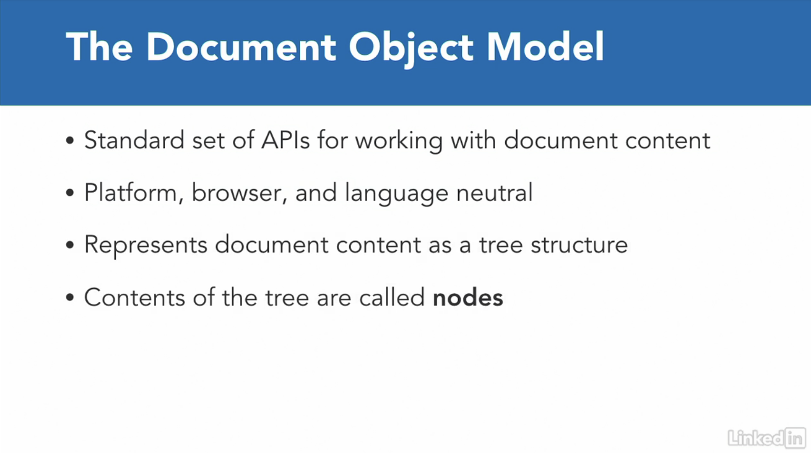

- The DOM represents the document content as a tree structure and the contents of the tree are called nodes.

- Let's take a look at an example and see how this works. Suppose I had an HTML document and this is a pretty simple one here on the left. I've got my html tag and inside there I've got the head and the body, the head has a title, the body has a paragraph. The DOM represents this document as a tree structure. At the top is the HTML node, inside the HTML node are the head and the body, and these are said to be child nodes of the HTML node, which is the parent. Then inside the head and body are the title and paragraph tags respectively. And so far we've talked about tags, but the actual content of these tags are themselves nodes within the DOM. So inside the title tag there's a text string called Document, and inside the paragraph there's a text string which has the value Paragraph Text. And each one of these is a node in the document. We can express the relationship between these nodes using familiar family-style names. So, for example, the head and the body are child nodes of the HTML node, which is said to be the parent. The title is a child of the head node and the document is a child of the title node. The head and body nodes are siblings of each other.

    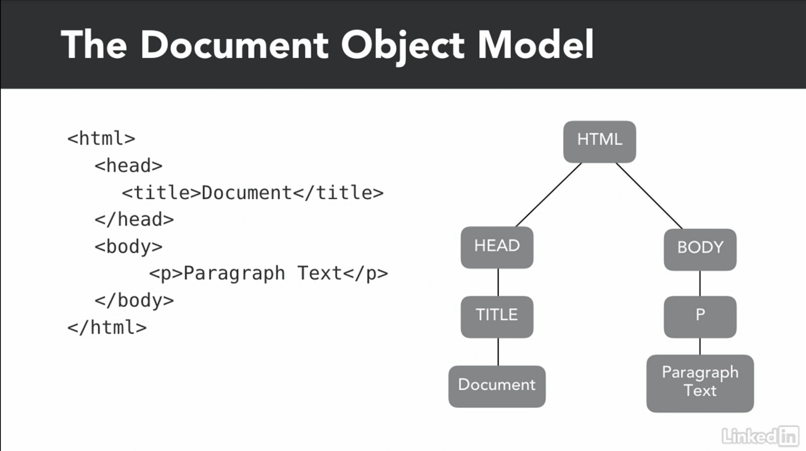

Let's talk about some important DOM properties that you'll come across when using these functions.

- Below 4 provide information about any given node.

    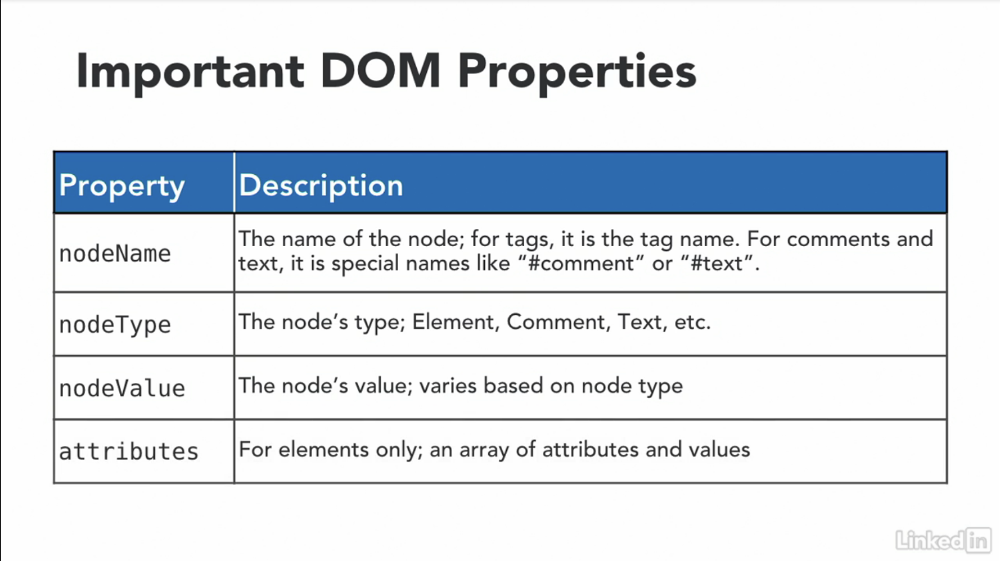

- There are also properties for accessing the family relationships of nodes.

    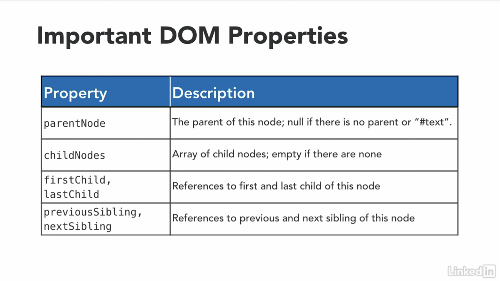

- There are functions for taking nodes and moving them around in the document.

    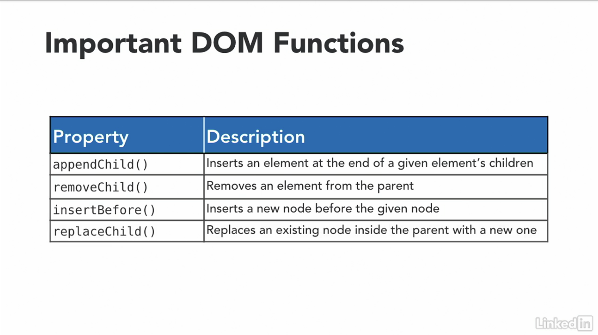

- There are also properties and functions for doing things like accessing and creating document content.

    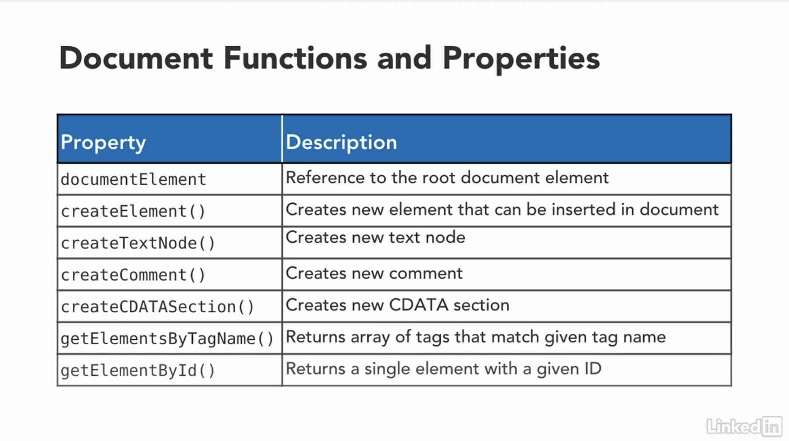

- There are some other important miscellaneous properties.

    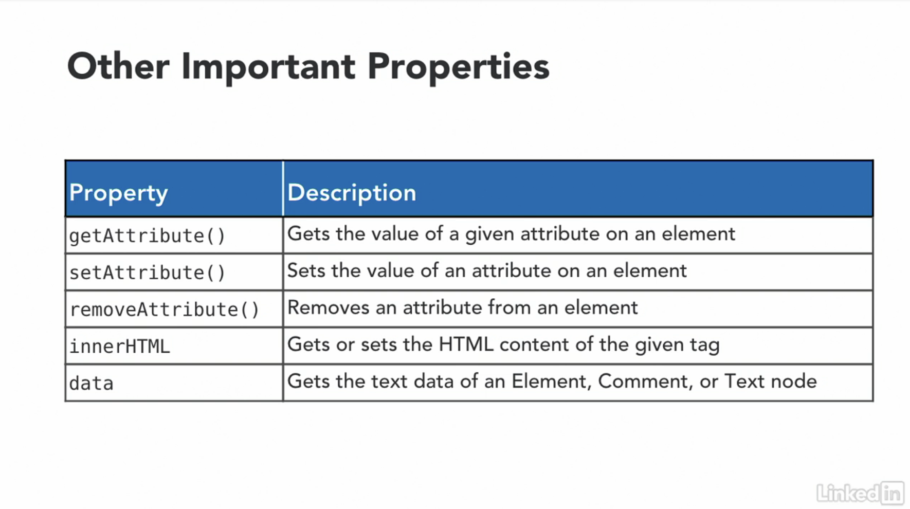

### <strong>Discovering Document Content</strong>

Checkout this file which demonstrate how we can use the DOM APIs to discover information that's in a document - [Example-1](04-Manipulating_XML_with_DOM/01-Example.html)

You can see that I've got a pretty simple HTML file. In the HTML content, I've got an XML tag, which I'm using to embed XML content into the webpage. And in case you're wondering, yes that is perfectly legal to do within HTML. The browser will see the HTML tag and parse it like any other tag, it just won't know what to do with it, it won't do anything special with it. Now, in real world usage, you probably won't see XML used like this. Typically, XML data will be the result of some web service call or it will come from a database or you retrieve it using Ajax, and then operate on it separately. But in the interest of keeping these examples simple and self-contained, I'm just embedding the XML content right here into the webpage. Now I didn't have to use the name XML for the tag, I could just use any other tag, but I have it use XML to indicate what it is.

### <strong>Discovering Document Content</strong>

In the previous example, we saw how to use the DOM API to discover and extract document content. In this example, we're going to see how to use the DOM to create new document content.

Checkout this HTML file, [Example-2](04-Manipulating_XML_with_DOM/02-Example.html) and CSS file [CSS File](04-Manipulating_XML_with_DOM/BusinessCardstyle-1.css)

When you're working with the DOM, you can manipulate the content in any way that you want. You can use the presence of certain tags to trigger certain actions. You can reorder document content. You can selectively include content or derive new calculated content. So, using the DOM to manipulate xml is very very powerful.

### <strong>Practical Example</strong>

Checkout the code here, [Cafe](04-Manipulating_XML_with_DOM/practicalExample/)

## XML and XPath

Earlier we talked about some complementary technologies for working with XML. One of those is XPath, which is what we're going to cover in this section

### <strong>What is XPath?</strong>

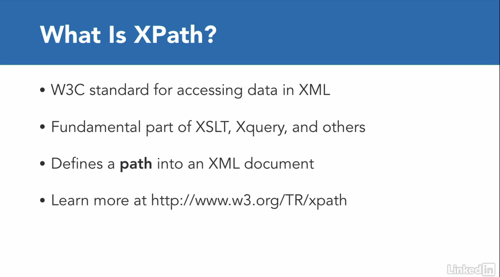

- XPath is query language for navigating in XML documents and it can be used to find the nodes in XML document or element in HTML web page.

- XPath is a W3C standard for accessing data in XML content. It's a pretty fundamental part of some other XML technologies, like XSLT, Xquery, and some others.

- Essentially, XPath provides a way to extract information from XML content using path notation. You can think of this as being analogous to the way that directory paths work in a file system.

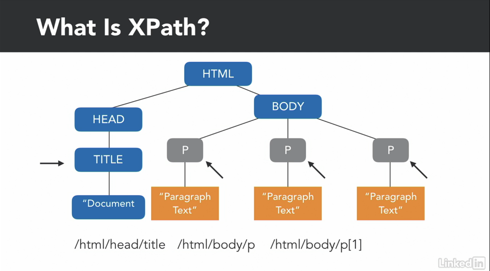

Probably the best way to see what I mean by defining a path into a document is to take a look at a few real examples. Suppose we had an HTML document that represented in tree form like this. Now, suppose we wanted to get a reference to this title tag right here. We could define a path into the XML content by writing something like this. A slash, then HTML, then another slash, then head, and then another slash, and then title. And that essentially means, starting at the HTML tag, go down to the head tag and then go down to the title tag. All right, suppose we wanted to do something a little more advanced. Suppose we wanted to get references to these three paragraph tags. Now remember, in file systems, file names have to be unique within a given directory. But, in XML, you can have multiple tags of the same name under the same parent tag. So, in this case, we would write slash HTML, and then slash body to get down to the body tag, and then slash p. That would give us all three paragraph tags. If we only wanted, say, this paragraph tag, then we would modify the path expression by putting what's called a predicate expression at the end of the path. In this case, a bracket with the number one. Now, that might be a little confusing if you're used to other programming languages where arrays are indexed using zero as a base. XPath is one based. So, that would give me the first paragraph tag.

So, let's review some important XPath concepts:

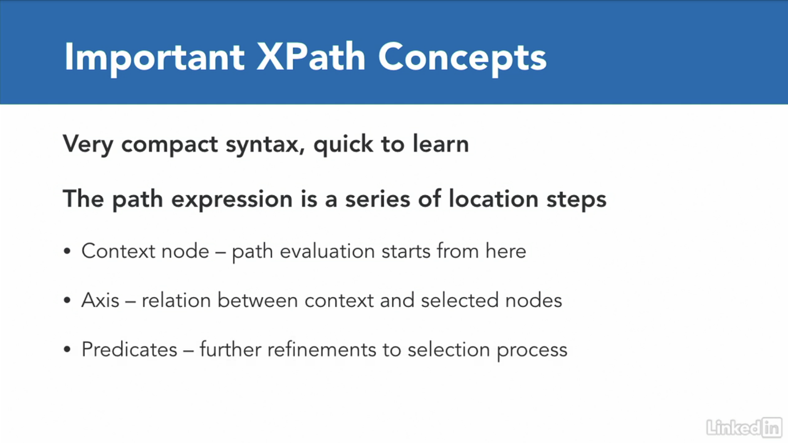

- XPath has a very compact syntax and it's pretty quick to learn.

- The path expression is a series of what are called location steps. So, for example, when I wrote slash HTML and then slash body, each one of those is a location stamped in the document.

- There's something called the context node. That's where the path evaluation starts from, and in more advanced scenarios using XPath, you can change the context node to be whatever you want. Now, I'm not going to get into that here. But, you should just be aware that it's possible, and that it's essentially the node we start evaluating the path from.

- There's also the notion of an axis. The axis is the relation between the context and the nodes that are selected by the path. So, you start at the context node. You end up at the selected nodes, and then that path is called the axis.

- Another term to be familiar with, and I've already used it, is predicates. I showed an example in the previous slide when I put that little bracket with the number one on the paragraph tag to narrow down my selection. Predicates are further refinements to the selection process. You can think of them almost as a kind of filtering method.

Let's take a look at some path examples-

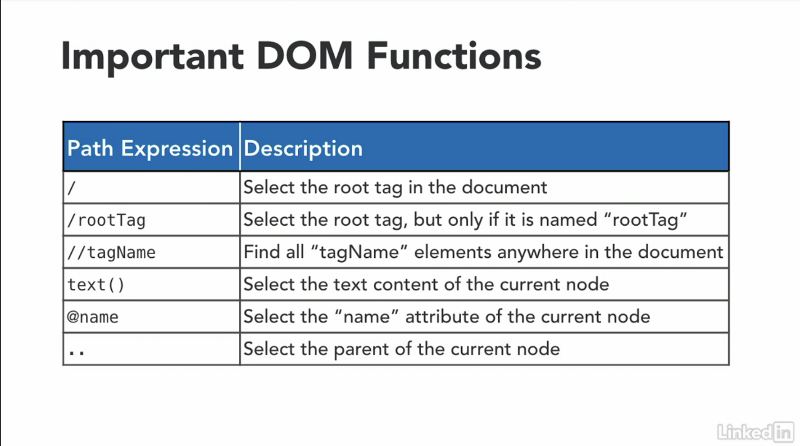\
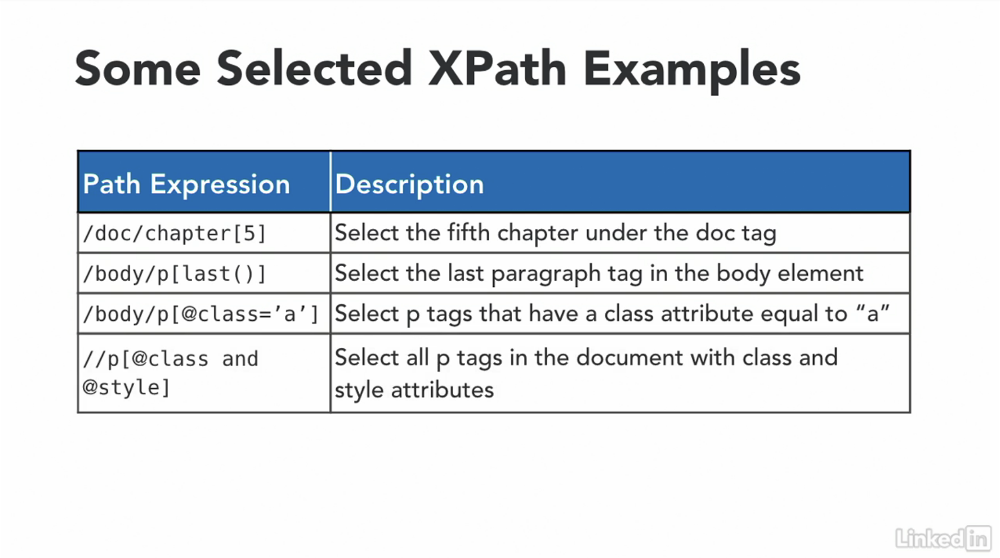

Checkout this video to see the real application of XPath, [Automation Step by Step - What is XPath | How to create XPath | for Beginners](https://www.youtube.com/watch?v=U-MZJ6rbqi4)

## XML and XSLT

XSLT is another one of the complimentary XML technologies that you can use to work with XML data and It builds on XPath.

### <strong>What is XSLT?</strong>

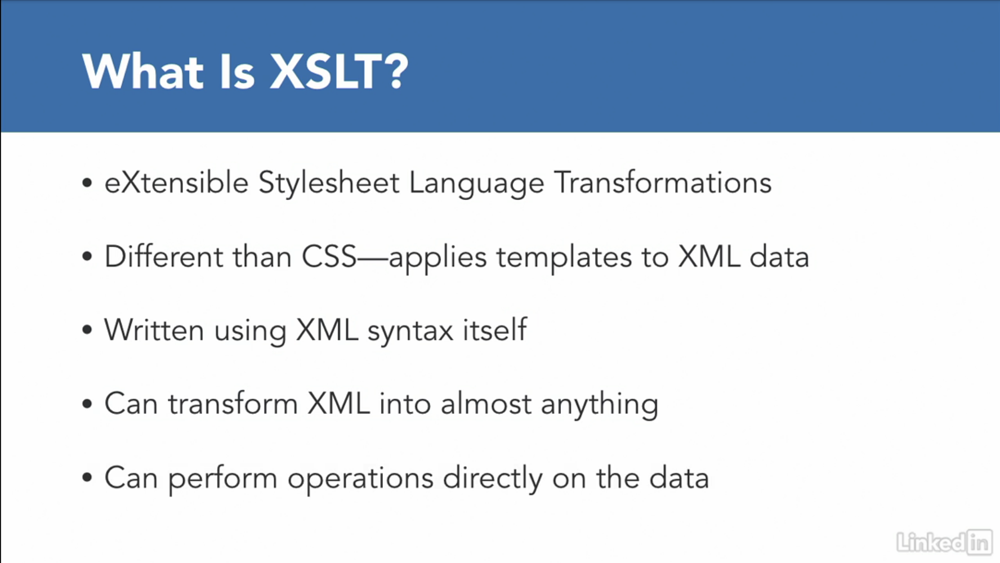

- XSLT is the eXtensible Stylesheet Language Transformation specification. It's a little bit different than CSS. ***You might see that word stylesheet and think that XSLT is similar to CSS, but the important word you need to focus on is transformations.*** CSS essentially applies a set of styling rules to content in either HTML or XML files. XSLT works by applying templates to XML data.

- XSLT is also written in XML syntax itself, so when you look at an XSLT stylesheet, it's written using XML code, whereas CSS is written using its own unique format.

- XSLT is pretty powerful. It can transform XML data into almost anything else, such as another form of XML or PDF or Word files or HTML, it can be almost anything.

-  XSLT can also perform operations directly on the data, so things that might take time working with DOM, for example, generating numbered lists or sorting information can be done pretty easily in XSLT.

- Learn more about XSLT at http://www.w3.org/TR/xslt

Let's talk a little bit about how you create XSLT stylesheets:

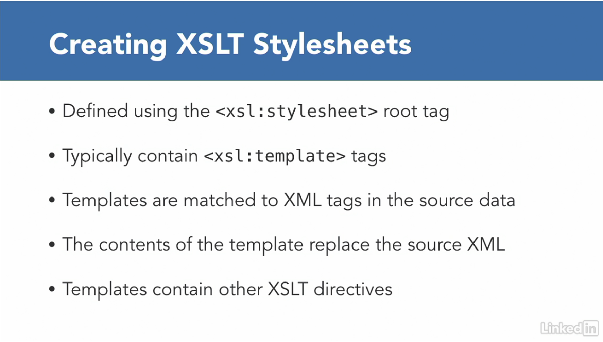

- They're defined using the \<xsl:stylesheet\> root tag.

- They also typically contain one or more \<xsl:template\> tags which contain the definition for the template.

- Templates are then matched to XML tags in the source XML data. Given a source XML file, the template is applied against it. The template then figures out which one or more than one of the XML elements in the source data it applies to, and then the template does its work.

- Usually, the contents of the template replace the source XML and transform it into whatever the output data is.

- Templates can contain other XSLT directives. You can do things like loop over content, sort content, insert new content in the output etc. In addition to being matched to source XML data, templates can also be invoked by name, almost as if they were a function.

Let's take a look at how XSLT works.

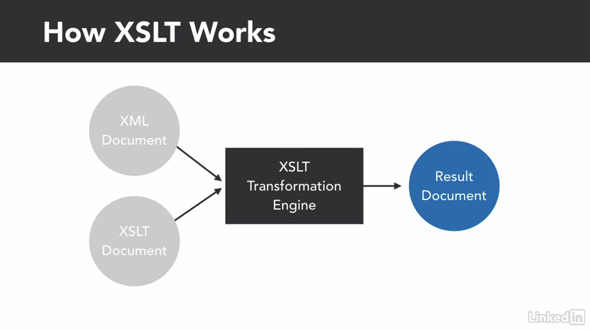

You define an XML document, and this is where your source data comes from. You then define a matching XSLT stylesheet. Each of those is fed into an XSLT Transformation Engine. Now, this is usually the browser, in the case of the web, but there's also server side implementations that do this, as well. So if you're doing any back end server work, you can take XML and XSLT content and transform it on the back end before the resulting data is sent to the browser. The output of this is a result document, which contains the transformed XML into whatever you transformed it into, more XML, PDF, Word, it doesn't really matter. 

### <strong>Using XSLT with XML</strong>

Before we get started writing our own XSLT Stylesheets and trying them out, I'm going to review some of the more common XSLT elements.

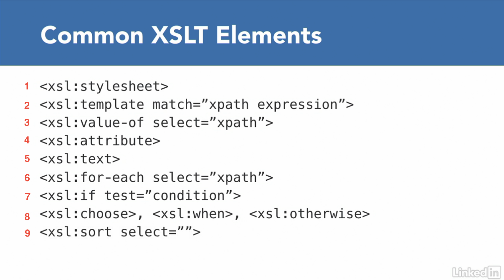

1 - This is the <strong><em>xsl:stylesheet</em></strong> tag. This is how you define an XSL Stylesheet. 

2 - The <strong><em>template</em></strong> tag contains either a match attribute, which is an xpath expression which determines how the template is matched to the content in the source XML data, or it has a name attribute. Templates with name attributes can be called as if they were functions.

3 - The <strong><em>xsl:value-of</em></strong> also uses an xpath expression, and this is used to select data in the source document. Text data, numerical data, whatever the data content is in the source XML file, it's how you extract data from a matched tag. 

4, 5 - You could also insert output into the transformation stream by using tags such as <strong><em>xsl:attribute</em></strong> and <strong><em>xsl:text</em></strong>. These will generate content that is placed into the transformed document.

In addition to tags for matching and inserting content, there are some control tags.

6 - There's a <strong><em>xsl:for-each</em></strong> tag that can be used to loop over repeating items in an XML file, and again, it used Xpath to select the nodes it loops over.

7 - You can also use an <strong><em>xsl:if</em></strong> tag to perform if else comparisons.

8 - In addition to <strong><em>xsl:if</em></strong>, you can use the <strong><em>xsl:choose</em></strong>, <strong><em>xsl:when</em></strong>, and <strong><em>xsl:otherwise</em></strong> construct, which is sort of similar to a switch case construct in other programming languages to perform more advanced decisions.

9 - You can use the <strong><em>xsl:sort</em></strong> tag to select data for sorting content in the output stream.

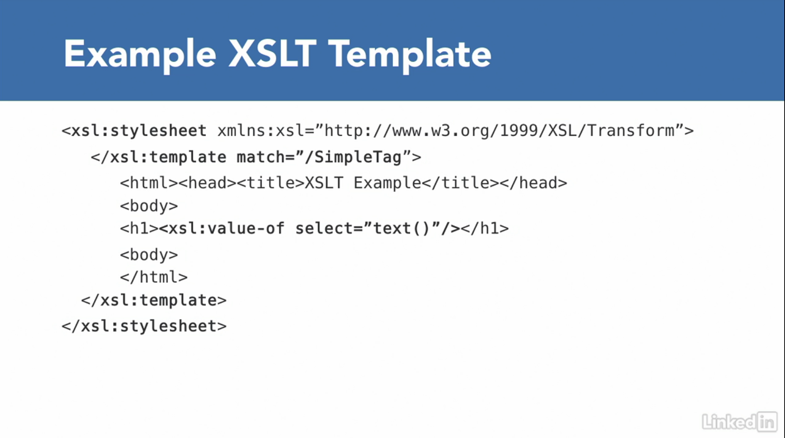

Checkout this video to know more about XSLT with demo, [Automation Step by Step - XSLT Beginner Tutorial with Demo](https://www.youtube.com/watch?v=W--Yhp0m35A&list=PLhW3qG5bs-L9DloLUPwC3GdFimY5Ce_gS&index=6)

## XSLT Examples

### <strong>Simple XSLT</strong>

Checkout an example here, [simpletransform.xml](07-XSLT_Examples/simpleExample/simpletransform.xml)
and [simpletransform.xslt](07-XSLT_Examples/simpleExample/simpletransform.xslt)

### <strong>XSLT and CSS</strong>

XSLT and CSS are not mutually exclusive. Both can be used in tandem.

Checkout an example here, [simpletransform.xml](07-XSLT_Examples/XSLT_and_CSS/simpletransform.xml), [simpletransform.xslt](07-XSLT_Examples/XSLT_and_CSS/simpletransform.xslt) and [stylesheet.css](07-XSLT_Examples/XSLT_and_CSS/stylesheet.css)

### <strong>Repeating Items</strong>

Checkout an example here, [repeating_items.xml](07-XSLT_Examples/repeatingItems/repeating_items.xml) and [repeating_items.xslt](07-XSLT_Examples/repeatingItems/repeating_items.xslt)

If you look in 'repeating_items.xslt', you will find image tag is not used as empty tag and we are closing it.\
The fact that I've got an \ with a closing image tag, because that's not normal HTML. This is an XML file, so we have to have matching closing tags. And I could've just done this to close the empty tag, but what I'm going to be doing is using the XSL attribute tag to add attributes to this image. At the end of the day, the parser will make all those look right.

### <strong>Conditional Logic</strong>

Example 1 (if) - [conditional_logic.xml](07-XSLT_Examples/conditionalLogic/conditional_logic.xml) and [conditional_logic.xslt](07-XSLT_Examples/conditionalLogic/conditional_logic.xslt)

Example 2 (choose, when & otherwise)- [conditional_logic2.xml](07-XSLT_Examples/conditionalLogic/conditional_logic2.xml) and [conditional_logic2.xslt](07-XSLT_Examples/conditionalLogic/conditional_logic2.xslt)

### <strong>Sorting</strong>

Checkout an example here, [sorting.xml](07-XSLT_Examples/sorting/sorting.xml) and [sorting.xslt](07-XSLT_Examples/sorting/sorting.xslt)

## Document Type Definition (DTD)

### <strong>What is DTD?</strong>

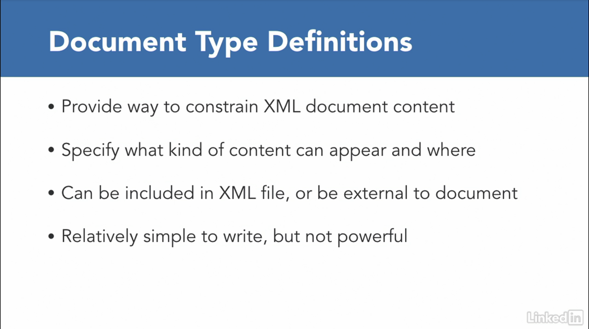

- There are a couple of different ways to associate sets of rules with your XML documents to help ensure their quality, and make sure that they are as error-free as possible. One of those ways is through what are called document type definitions.

- Document type definitions provide a way to constrain the content of XML documents so that you can specify what kinds of tags and attributes and other types of content are and are not allowed. You can specify what kind of content can appear, where it can appear, and what kinds of content tags themselves can have.

- DTDs can be included directly in an XML file or be declared as an external DTD and then associated with more than one XML document.

-  DTDs are pretty simple to write, but the trade off is that they're not that powerful. There are some basic rules you can lay down, but XML schema is actually a lot more powerful.

-  So why would you use a DTD?\
Well, if you're taking your XML code and you're giving it to third parties or if you have a complex process that consumes the XML, it's always a good idea to make sure that the XML code is in a proper format. DTDs help make that possible. You can give your DTD out to people that are consuming your XML, and when the parser goes to load the XML, it will compare your DTD rule set with the content so that errors can be found quickly. Certain kinds of XML tools, like XML editors, can also use DTDs to help you create XML content on the fly so that errors won't be introduced while you're doing the creation process.

### <strong>DTD Syntax</strong>

Let's take a look at the basic syntax and content of a DTD file.

- DTDs contain markup declarations that define document content. In other words, they lay down the rules for what an XML document that uses that DTD can and cannot contain.

- DTDs can specify a variety of document content rules involving elements, attributes, entities, notations, processing instructions, comments, and parameter entity references. In other words, DTDs can specify just about every single kind of XML file content type that we looked at earlier.

- Now, those last five, from entities down through parameter entity references, are pretty fairly advanced. So, the focus will only be on DTDs that define elements and attributes because those are by far the most common examples you're going to find when you're working with DTDs.

- A DTD has the format of an opening angle bracket with an exclamation point, the word DOCTYPE, followed by the name of the root tag in the file, which is then followed by the document type definition itself. Now, the format you see here, with those brackets, is for including the DTD directly in the XML file. When we go to make an external DTD, the format is slightly different.

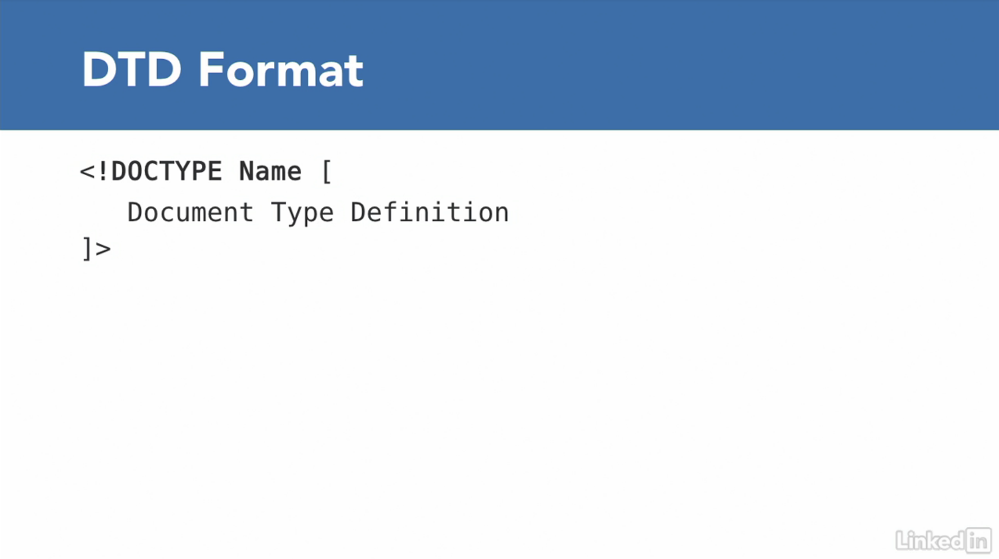

### <strong>Declaring Elements</strong>

Declaring elements inside a DTD is accomplished using an elements declaration, and element declarations have the format of an angle bracket followed by exclamation point and the capital word **ELEMENT** followed by a name and a **ContentSpecification**. The **'Name'** field here is the name of the element you're going to be declaring and the content specification defines what the valid contents for the element is.

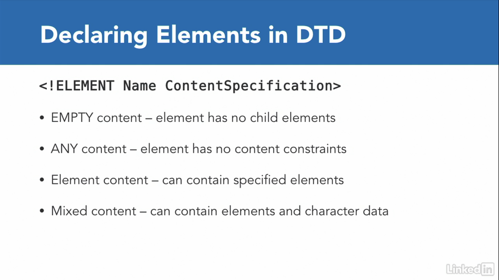

Elements can contain one of four different types of what are known as content model is.
- First is the 'EMPTY' content model in which the element has no child elements at all. No text, no tags, nothing. A good example of this is the image tag in HTML or the horizontal rule tag and so forth. them.

- Next is the 'ANY' content model, which is the opposite from empty. This means the element has no content constraints whatsoever, it can contain pretty much anything.

- Then there's the 'Element' content model, which means the element can contain the child elements that you list for the content specification, but that's it. You can't put other elements that are not inside the content specification inside that element. 

- Finally there's 'Mixed' content, in which the element can contain elements and character data.

Let's take a look at some examples of these different types of content models.

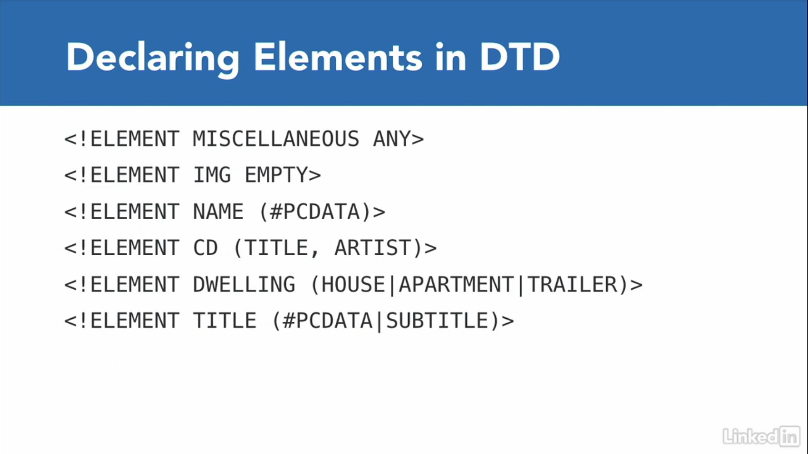

1. Here we're defining an element named 'Miscellaneous' and the keyword 'ANY' there at the end of the element declaration means that the miscellaneous element can contain anything. There's no limit on what could be inside. It could be elements, text, pretty much anything.

2. An empty element declaration would look like this. Here, we're defining an element named image and then the keyword empty goes at the end, which means it has to be empty, there's no content inside this element.

3. Defining character data content is used with the keyword PCData inside parentheses. PCData means Parsed Character Data, so in this case the element name is allowed to have character data inside of it. You might be wondering if there is a way to define an element that has a C data section in it which is unparsed and the answer is remember, C data tag itself is in fact parsed. It's only the text content inside the C data section that's unparsed so there's no way to specify that an element can contain only a C data section.

4. Element content means that the element in question can have other elements inside of it and there's a couple different ways to do this. 

    - The first is the sequence model. In this case, we have an element named CD which can contain a title and an artist tag and it's interesting to note here that what this means is that the CD element has to have exactly one title element and it has to have exactly one artist element and they have to appear in that order.

    - If you want them to appear as a choice, you would define the element content using a choice model. In this case, we have a dwelling element which is using a choice model and inside the parentheses we have three different elements that are valid for the dwelling element content. Inside of dwelling you would find either an element named house, or one named apartment or one named trailer. These element names are separated by the vertical bar character, so what this means is that you are allowed to choose one of these elements to appear in there and only one is allowed.

    - To define mixed content, you would use the PC data keyword with the vertical bar and any other elements you would like to be allowed inside the element that you're defining. In this example, we're defining an element named title and the title element is allowed to have parsed character data inside of it as well as one subtitle tag. In this case, it doesn't really matter where each one appears, you can have them in any random order.

Let's go back to the problem of specifying how many elements are allowed to appear inside an element that you're defining.

To modify the element declaration to indicate how many elements it's allowed to contain, you can use certain modifier characters to control how many elements can appear. These characters are the question mark, plus, and star symbols.

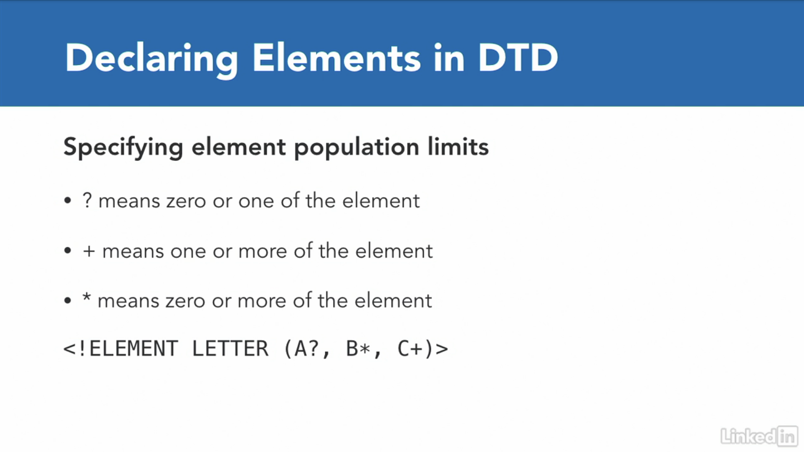

### <strong>Declaring Attributes</strong>

Declaring attributes in a DTD, is accomplished in much the same fashion as declaring elements. All attributes that you are intending to use in a document that is going to be validated by a DTD, have to be declared via an attribute list declaration.

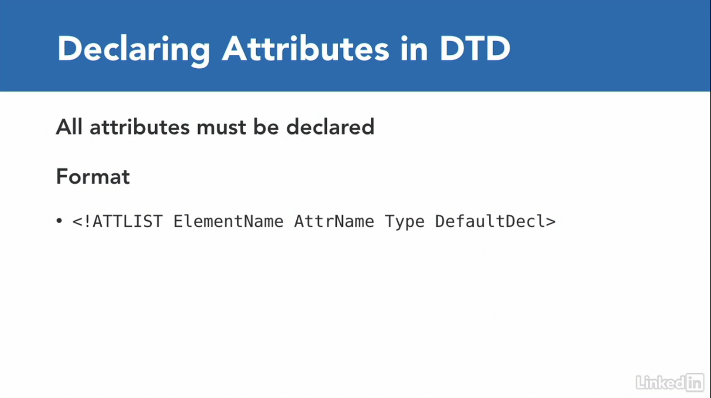

An attribute list declaration looks like this. It has an opening angle bracket with an exclamation point, followed by the capital word 'ATTLIST', and is closed by a closing angle bracket. The 'ElementName' is the name of the element that you are defining the attributes be used on. The 'AttrName' is the name of the attribute, the 'Type' is the attributes type, and the 'DefaultDecl' defines how the attribute behaves under default situations.

The attribute type can be one of three types:

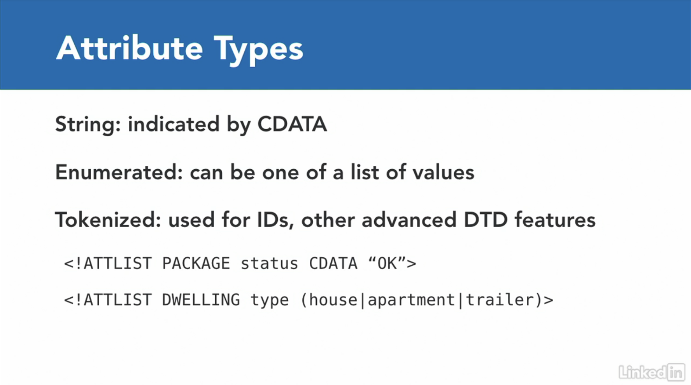

1. There's the string type, which is indicated by the CDATA keyword, which is all capitals. This means the attribute can be any literal string, and you can just type in the value for the attribute.

2. The enumerated type means that attribute can come from one of several potential values, but any other value would result in an error.

3. And then there's the tokenized type. The tokenized type is reserved for things like ID's, and ID's refs, and other advanced features of DTD.

The <strong><em><u>String type</u></em></strong> is declared like below:

```
<!ATTLIST PACKAGE status CDATA "OK">
```

In this example, we are declaring a status attribute, for a package element. In this case, it's a string attribute because of the CDATA keyword, and the default value is in the quotes there in the end, and the default value is OK. What this means is, if you don't define the status attribute on an element in a XML file, and you request the value of that attribute using the DOM API, it will still have the default value of OK, just as if you had typed it into the XML data and put it there yourself. Now of course because it's a string type, and there's no other constraints on it, you could put other values in there as well, but this is a way of telling the XML processor that if a certain attribute is not included, there is a default value.

An <strong><em><u>Enumerated type</u></em></strong> looks like this:

```
<!ATTLIST DWELLING type (house|apartment|trailer)>
```

In this case we are defining an attribute, for a dwelling element, and the type can be one of the following inside the parenthesis separated by those vertical bar characters. And that's pretty similar to how you define a choice type for an element declaration. So in this case the type attribute for the dwelling element can either be house, or apartment, or trailer. It can't be something like mobile home, or condo. That would result in an invalid attribute.

The default declaration is a way of defining, not just default values, but how do attributes should be viewed by the processor. There's a couple of ways you can modify the default declaration.

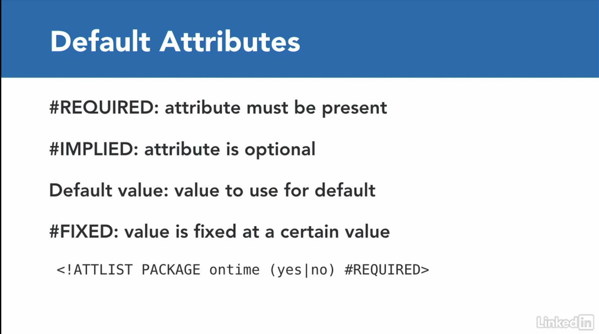

In the example shown in above screenshot, we have an attribute named on time. And on time is required, and it can be either yes or no.

```
<!ATTLIST PACKAGE ontime (yes|no) #IMPLIED>
```

In this case, we have an on time attribute, and it's either yes or no, and it's implied. In other words, the XML mark up may, or may not contain it.

```
<!ATTLIST PACKAGE ontime CDATA #FIXED "yes">
```

In this example, the on time attribute for the package is character data, and it's fixed to the value of yes. If you put anything else in there, that would be an error.

### <strong>Building a DTD for a business card</strong>

Let's build a DTD for our business card example.

checkout [businesscard.xml](08-Document_Type_Definition/businesscard_1.xml)

In this particular case, we've declared the document type to be in-line with the XML data. It's included here in the XML file. And that's perfectly okay, but this gets impractical when you want to work with XML documents that are non-trivial, and especially when you want to distribute multiple XML documents, you don't want them all to contain the document type definition because if the DTD ever changes, then you've got multiple places where you need to go update it. So what we're going to do next is declare it as an external document type definition, and then associate it with our XML file.

### <strong>Associating a DTD with XML data</strong>

Here's the Business card XML and external dtd file respectively:

[businesscard.xml](08-Document_Type_Definition/businesscard_2.xml) & [businesscard.dtd](08-Document_Type_Definition/businesscard.dtd)